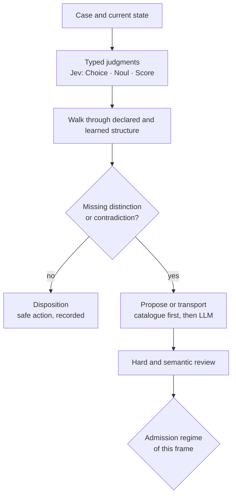
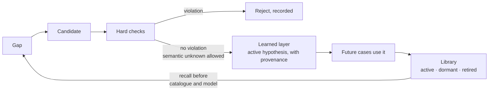
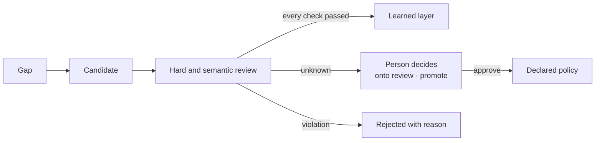

# onto

**An evolutionary graph runtime for typed, calibrated judgments, whose
growth is governed by a regime the application chooses.**

You declare a category: objects, arrows, equations, and the policy around
them (capabilities, entry contracts, invariants, attesters, what models
may see). A fast System-1 model such as Jev walks it with typed judgments
(Choice, Noul, Score). When a case shows a distinction the graph lacks,
onto proposes structure, from a trusted catalogue first and a language
model second, and checks it against the policy before it enters a
separate learned layer, under the admission regime declared for that
frame.

onto is not an ontology that freely rewrites itself. It is application
infrastructure that discovers what it is missing, case by case, proves
what can be proved about each change, and admits changes only within the
limits people declared.

> Design: [`docs/00-architecture.md`](docs/00-architecture.md) ·
> positioning: [`01`](docs/01-positioning.md) · semantics: [`02`](docs/02-dispositional-semantics.md) ·
> joins: [`03`](docs/03-joins.md) · **trust model**: [`04`](docs/04-trust-model.md) ·
> functors: [`05`](docs/05-functors.md) · the four spaces: [`06`](docs/06-spaces.md) ·
> what the raster shows, tested: [`07`](docs/07-raster-findings.md) · call economy: [`08`](docs/08-call-economy.md) ·
> the learned-structure library: [`09`](docs/09-learned-library.md) ·
> the engine and its Python bindings (design): [`10`](docs/10-bindings.md) ·
> calibrated switches (research): [`12`](docs/12-calibrated-switches.md)

## The loop

onto supports **two evolutionary regimes over the same runtime**.
Open-world applications may activate structurally valid but semantically
uncertain hypotheses in a provenance-bearing learned layer. Assured
applications quarantine uncertainty until an authorized decision admits
it. onto does not only evolve a graph; it lets an application state how
it lives with the unknown: learn by trying, or wait for authorized
verification.

### The shared core

Both regimes run the same steps up to admission: same category store,
same typed judgments, same proposer and transport, same review, same
provenance.



The review separates two kinds of result:

- **hard failures**: invariant, capability authority, entry contract,
  well-formedness, sealed region, a learned cycle, `unseen`: always
  **rejected**, in every regime;
- **semantic unknowns**: the critic could not decide a rule, a
  duplicate or an overlap: here the regimes differ.

(A closure challenge, a proposal into a frame claimed complete, is what
a missing enumeration looks like; it is not an unknown in either regime.)

### 1. Open-world learning

For expanding fast where the domain is not yet known: support taxonomies,
research and discovery tools, product feedback, hypothesis spaces,
personal knowledge, fast-changing operations.



A learned arrow is a hypothesis in use, not a proven fact: it carries its
provenance (record, checks, source), and it is never deleted. It stays in
a library: **active** (in the graph), **dormant** (out of the graph,
recalled at a gap at its frame before a catalogue or a model is asked),
or **retired** (a person's decision). Dormancy is a person's act, after
measuring what the arrow's presence does (`onto learned --usage`,
`onto replay --without-arrow` / `--with-arrow`):
[`docs/09`](docs/09-learned-library.md).

### 2. Assured evolution

For keeping uncertain structure from producing authorized decisions:
consent and data use, benefits eligibility, financial authorization,
infrastructure changes, auditable institutional policy.



### Chosen per frame, not per application

```
admission: sealed;                      # default for frames that declare none
admission CustomerIntent: open_world;   # learn by trying
admission LegalBasis: assured;          # wait for authority on the unknown
admission EvidenceComplete: sealed;     # reached only by declared arrows
```

`sealed: A;`, `learnable: A;` and `world: open | closed;` remain as
shorthands. A run can tighten admission (`--loop assured` makes every
learnable frame assured; `--closed-world` learns nothing), never loosen
it. `onto laws` lists every frame under its regime.

Three questions, kept apart:

| concept | the question it answers |
|---|---|
| **closure** (`closed:`) | are this frame's options complete? |
| **admission** (`admission …`) | how is uncertain new structure accepted here? |
| **layer** | what trust does accepted structure carry? |

### Authority by layer

| layer | what it may do |
|---|---|
| **declared** (the `.onto` file) | carry policy authority: issue capabilities, set contracts, declare what is sealed |
| **transported** (from a catalogue, via a functor) | complete an enumeration the catalogue claims; bounded by the catalogue and the functor, both policy; no capabilities of its own |
| **learned** (open-world or assured) | route cases; never issue a capability (`ConsentGrant`, `DeployGrant` come only from declared issuers), never bypass an entry contract, an attested precondition or a sealed region |

A learned option can change how a support ticket is routed; on its own it
can never authorize a data use or a deployment.

### Where each step lives

| step | in onto |
|---|---|
| case and current state | job JSON; attested view; `state { … }` declares what a model may see; precedents (`memory: similar N`) |
| typed judgments | Jev; confidence gate; `none_of_these` always offered; `grouped by` frames |
| walk | engine: frame claims, forks, joins (`all`, `race`, `gate`) |
| disposition | frame records (`--dispositions`, `onto why`); capabilities and attestation decide what may happen |
| missing distinction | escalation, **typed**: a structure gap (the proposer may help), an evidence gap (only evidence helps: no model), a policy stop (a gap signal for curation), a budget stop |
| contradiction | a join that cannot complete; in an ensemble, columns whose positions do not reach each other in the shared category (a surprise: a person under `assured`, a gap signal under `open_world`) |
| propose or transport | only for structure gaps where structure may be learned: transport from a functor's empty fibers first, an LLM proposer second; one proposal in flight per gap (single-flight), no frame lock held while a model answers |
| curation | policy stops and closed-world gaps as gap signals (`<stem>.gaps.jsonl`); `onto curate`: one proposal per gap for review |
| review | structural proofs (well-formedness, authority, contracts, `via`/`never`, `unseen`, sealed, progress); critic checks (rules, duplicates, overlap), settled by structure where a closed catalogue already decides |
| learned layer | `<stem>.learned.jsonl`, replayed through the proofs on every load |
| person decides | `onto review`, `onto promote` (into declared policy, atomically, snapshot-checked) |
| rejected / held | on the step and frame record: `not learned …` / `held for a person …` |

## Try it

```sh
cargo build
onto=target/debug/onto
$onto check   examples/triage.onto
$onto run     examples/triage.onto --jobs examples/triage.jobs --mock         # offline
$onto ask     demos/support-commons/support.onto --from Ticket "my parcel never arrived" --mock
$onto laws    demos/consent-enforcement/consent.onto --proofs                  # what is proved
$onto functor demos/secure-infrastructure-change/controls.onto                 # a policy vs a standard
$onto discover demos/support-commons/merger.onto#Support demos/support-commons/merger.onto#Helpdesk --compare demos/support-commons/merger.onto#Merger
$onto ensemble demos/hospital-discharge/perspectives.onto#WithThePatient --jobs demos/hospital-discharge/perspectives.jobs
$onto ensemble demos/incident-response/perspectives.onto#Outage --jobs demos/incident-response/perspectives.jobs  # perspectives compared (live)
$onto run     examples/triage.onto --jobs examples/triage.jobs --mock --telemetry t.jsonl --dispositions d.jsonl
$onto raster  t.jsonl --dispositions d.jsonl --category examples/triage.onto  # what happened, in time
```

Live models: Jev (`TYPESAFE_API_KEY`) for judgments, any OpenRouter model
(`OPENROUTER_API_KEY`) for proposals. `--mock-proposer` keeps Jev live
without proposal spend.

## Demos

[`demos/`](demos/) holds Onto Commons: runnable projects with live
results in each README (support-commons, incident-response,
consent-enforcement, benefits-assembly, secure-infrastructure-change).
[`standards/`](standards/) holds shared categories that policies map into.

## Layout

`crates/onto-core` categories, paths, equality, walk, parsing, policy
checks, functors · `crates/onto-runtime` the async engine, providers,
supervisor, memory, lenses · `crates/onto-cli` the `onto` binary ·
`examples/` · `demos/` · `standards/` · `docs/` (start at
`00-architecture.md`).

## License

MIT, with DCO sign-off on every commit. See [CONTRIBUTING.md](CONTRIBUTING.md).
