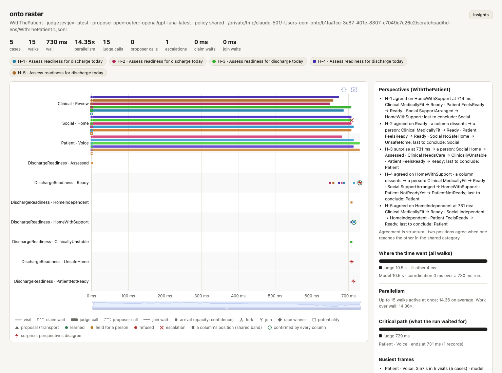

# Hospital Discharge

**A patient leaves hospital only when every part of going home is in
place, and a clinician signs off.**

**Human problem.** Discharges are delayed or unsafe because one part of
going home is missing: medicines not reconciled, no way to get home, no
support there, no follow-up. Each part belongs to a different team; the
patient waits in a bed, or goes home without what they need.

**Beneficiary.** The *patient leaving hospital* (and whoever cares for
them at home): four lines of work must all finish; when one does not,
the case says which.

## How it works

```
Discharge (split: four lines at once, no judgment)
  ├─ Medication ─ reconciled  attested medication.reconciled (Pharmacy) ─┐
  ├─ Transport  (choice, judged: family car | taxi | patient transport) ─┤
  ├─ HomeCare   (choice, judged: none | care visits | equipment)        ─┼─▶ ReadyToLeave  join: all
  └─ FollowUp   ─ booked                                               ─┘
ReadyToLeave ─▶ SignOff ─ signed_off  attested discharge.signed (Clinician)  ensures DischargeGrant
Discharged   entry: needs DischargeGrant
```

`state { case: summary, home, mobility; }` and `invariant unseen:
case.patient`: no model sees who the patient is. `admission HomeCare:
open_world`: new kinds of home support may be learned; everything else
is sealed.

```sh
onto run demos/hospital-discharge/discharge.onto --jobs demos/hospital-discharge/jobs \
    --policy shared --max-branches 6 --telemetry t.jsonl --dispositions d.jsonl
onto raster t.jsonl --dispositions d.jsonl --category demos/hospital-discharge/discharge.onto
```

## Observed (2026-09-24, live)

Built as the fork/join test of `docs/07-raster-findings.md` §4. No
discharge completed; the raster showed which line held each one up:
transport for three of four patients (none of the three options fit
"lives alone", "lives with his daughter; no car"), care at home for the
fourth (which learned `mobility_support` and stopped at the new frame).
The demo was designed with care at home as the gap; transport was the
real one.

## What it does not do

It does not book transport or care, or decide fitness for discharge; it
checks that the parts of going home are in place and that a clinician
has signed. Not clinical advice: the category encodes one fictional
ward's policy.

## Is the patient ready? Three perspectives (ensemble, 2026-09-24)

`perspectives.onto` asks one question from three sides that never see
each other: **Clinical** (only the clinical summary), **Social** (only the
home situation), **Patient** (only what the patient said). Each maps into
a shared `DischargeReadiness` (Assessed → Ready → HomeIndependent |
HomeWithSupport; NotReady → ClinicallyUnstable | UnsafeHome |
PatientNotReady), declared `assured`: a disagreement never discharges
anyone, it goes to a person. The columns are `sealed`: an unsure column
stops (its gap goes to curation) instead of learning new options.

```sh
onto ensemble demos/hospital-discharge/perspectives.onto#Discharge      --jobs demos/hospital-discharge/perspectives.jobs
onto ensemble demos/hospital-discharge/perspectives.onto#WithThePatient --jobs demos/hospital-discharge/perspectives.jobs
```

Live (Jev; synthetic cases):

| case | clinical · social · patient | `Discharge` (all of clinical, social) | `WithThePatient` (quorum 2) |
|---|---|---|---|
| H-1 fit, reablement booked | Ready · HomeWithSupport · Ready | agreed: HomeWithSupport | agreed: HomeWithSupport |
| H-2 fit, lives alone upstairs, care starts next week | Ready · **UnsafeHome** · Ready | **surprise → a person** | agreed: Ready, **social dissents → a person** |
| H-3 new fever and rising CRP; family can help | **ClinicallyUnstable** · (unsure) · Ready | **incomplete → a person**; social gap to curation | **surprise → a person** |
| H-4 fit, carers and alarm in place, patient frightened | Ready · HomeWithSupport · **PatientNotReady** | agreed: HomeWithSupport | agreed, **patient dissents → a person** |
| H-5 fit, independent, keen | Ready · HomeIndependent · Ready | agreed: HomeIndependent | agreed: HomeIndependent |

What it showed:

- H-2 is the case the ensemble exists for: the clinical view alone says
  "fit for discharge"; the unsafe home is visible only to the social
  view. Under `all` it is a surprise; under a quorum, two perspectives
  outvote the one that sees the risk, so a quorum's dissent is still
  routed to a person (D60).
- A first run counted a column still at its start as agreeing with
  everything (H-3 read "agreed: ClinicallyUnstable" while the social
  column had said nothing). Only columns that concluded now count.
- With open-world columns the social frame learned an arrow
  (`clarify_home_support`) and the run took 9.3 s; sealed, 0.73 s and no
  proposer calls.



Beneficiary: a patient leaving hospital. No perspective alone can
discharge them, and no majority can silence the one that sees the risk.
