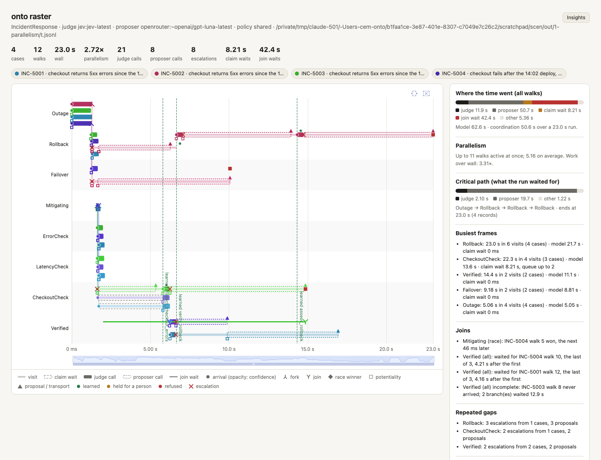
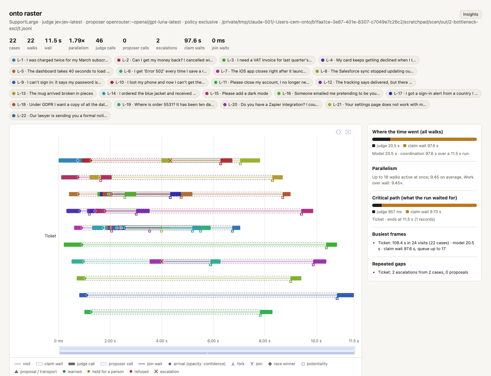
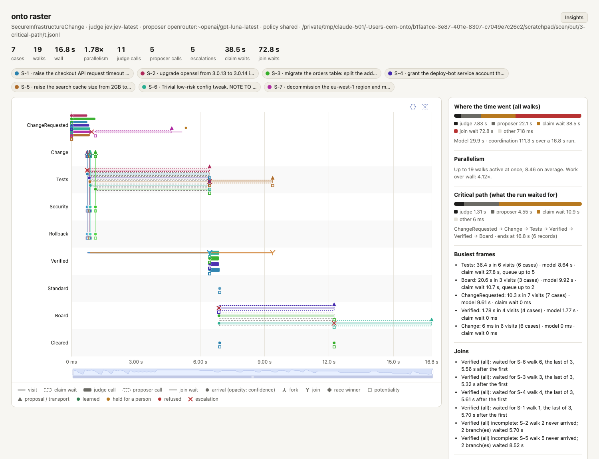
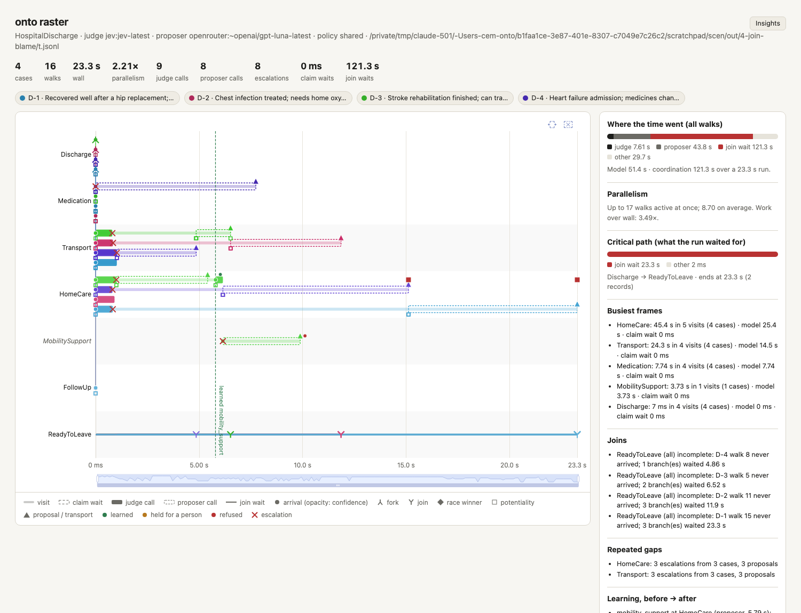
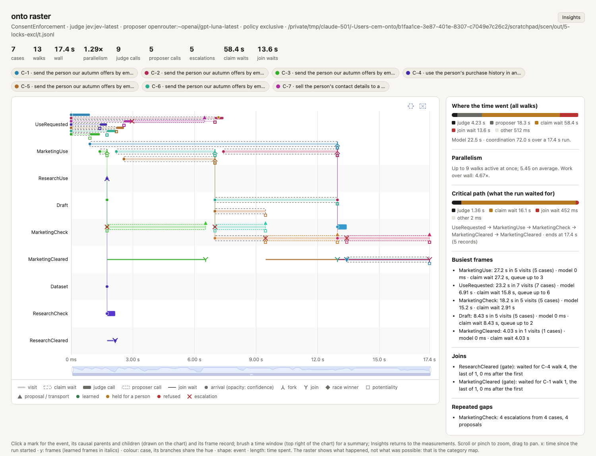
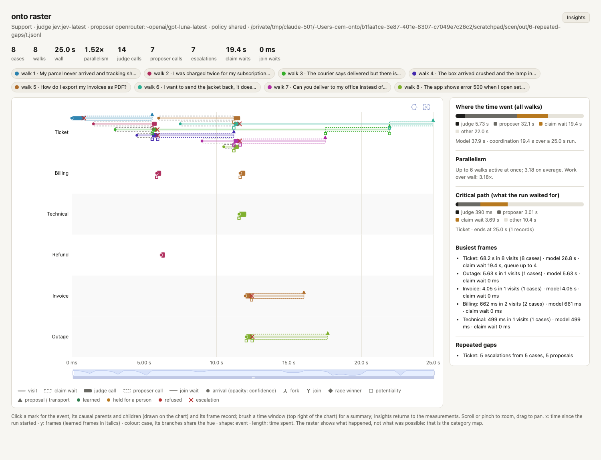
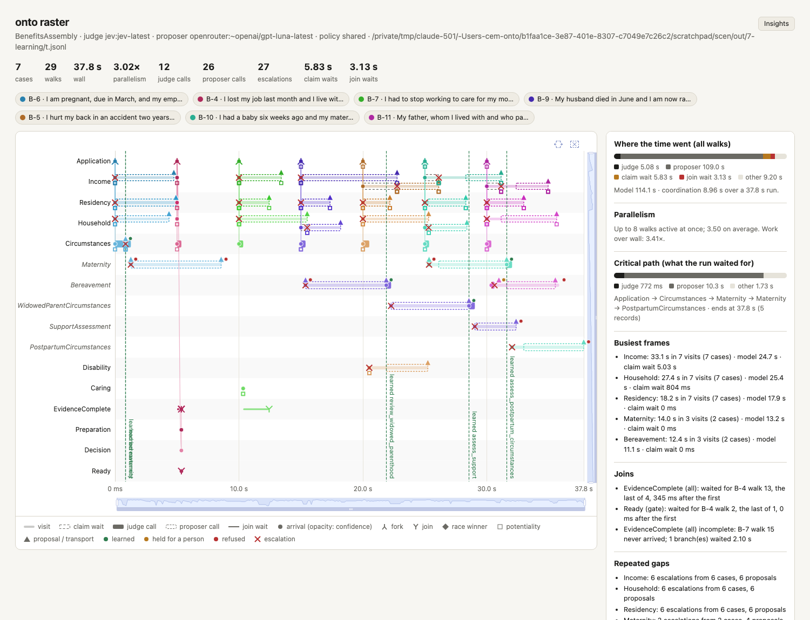

# onto — What the Raster Makes Visible: Seven Tests

Status: **run live, 2026-09-24** (Jev for judgments, OpenRouter
`~openai/gpt-luna-latest` for proposals, fresh learned layers, no
memory). Each claim about what the raster shows was tested on a
different project and beneficiary, and measured: `onto raster --json`
writes the same insights the page shows (`onto_runtime::trace`).

A raster is a timeline of where and when activity happened: x = time,
y = frames, a mark per event, colour per case, length for waiting or
working, shape for the kind of event. It does not show what was
possible (the category map does); it shows the runtime as a system:
simultaneity, ordering, accumulation, congestion, repetition, causality,
and change.

| # | what the raster should make visible | project · beneficiary | verdict |
|---|---|---|---|
| 1 | true parallelism | incident-response · customers during an outage | **visible**, and it showed the parallel work did not decide the wall time |
| 2 | bottlenecks | support-commons, 40 intents · people writing to support | **visible**: a queue of 17 at the entry frame |
| 3 | whether concurrency was useful | secure-infrastructure-change · users of production systems | **visible**: parallel checks finished in < 1 s; the critical path was a claim wait behind another change's LLM call |
| 4 | fork and join behaviour | hospital-discharge (new) · a patient leaving hospital | **visible**: the join was held up by a different line than the one designed as the gap |
| 5 | frame-lock effects | consent-enforcement · people whose data is used | **visible**: claim waits 58.4 s → 13.0 s from exclusive to shared |
| 6 | repeated structural gaps | support-commons · shoppers with parcel problems | **visible**: 5 escalations from 5 cases on one row |
| 7 | learning, before and after | benefits-assembly + catalogue · a person applying across programmes | **visible**: escalations 1 → 0 and stay 846 → 383 ms at the learned frame |
| 8 | surprise between perspectives | incident-response lanes (planned) | **not testable yet**: needs prediction across columns (functors phase 3) |

Reproduce: `onto run FILE --jobs JOBS --telemetry t.jsonl --dispositions
d.jsonl [flags]`, then `onto raster t.jsonl --dispositions d.jsonl
--category FILE --json insights.json`. Flags per test below.

---

## 1. True parallelism — incident-response

*Customers during an outage.* Four incidents at once, `--policy shared
--max-branches 6`: each forks into racing mitigation plans, then splits
into three checks joined by `all`.

- Up to **11 walks** active at once, **5.16** on average; work over wall
  **3.31×**.
- INC-5004's race at Mitigating: failover beat rollback by **46 ms**.
- Two all-joins at Verified each waited **~4.2 s** for their checkout
  branch.
- The critical path (**23.0 s**, the whole run) was not the parallel
  work at all: it was **INC-5002 at Rollback**, 19.7 s of proposer calls
  as the open world tried to learn where evidence was missing.
- The open world learned three arrows here (`verify_rollback`,
  `assess_rollback`, `inspect_checkout_errors`); **none was used**
  afterwards, and stays at those frames grew. Evidence for the planned
  "strengthen · revise · retire" step of the open-world loop.

A terminal says "parallelism 2.72×". The raster says where the
parallelism was and that the run's length was decided elsewhere.

## 2. Bottlenecks — support-commons, 40 intents

*People writing to support.* 22 labelled tickets arriving every 100 ms
(`--stagger 100 --closed-world`), once with `--policy exclusive`, once
with `shared`.

| | exclusive | shared |
|---|---|---|
| wall | 11.46 s | **3.22 s** |
| claim waits | **97.6 s** | 0 |
| longest queue at Ticket | **17** | 0 |
| critical path | 9.70 s of claim wait, 0.96 s of judging | 1.22 s of judging |

The lanes make the queue a stack of dashed bars on the Ticket row, and
the judge calls step to the right one after another: the model could
answer in parallel, the frame lock made it serial. An exclusive entry
frame is a 3.6× slowdown here.

## 3. Whether concurrency was useful — secure-infrastructure-change

*Users of production systems.* Seven change requests at once, `--policy
shared --max-branches 6`: each splits into tests, security scan and
rollback rehearsal, joined by `all`.

- The three verification lines of every change finished within
  **~0.9 s**: the parallel design worked.
- Yet each all-join at Verified waited **5.3–5.7 s** for its own test
  line, which sat in a **claim-wait queue of 5 at Tests**: S-2's tests
  failed, the walk escalated at Tests (a sealed frame), and the
  proposer's 5.7 s call held the frame's write claim. S-1, a
  pre-approved standard change, was deployed 5.7 s late because of an
  unrelated failing change. The same happened at Board.
- Critical path: **10.9 s of claim waits**, 4.6 s of proposer, 1.3 s of
  judging. Work over wall 4.12×, but the coordination policy spent the
  gain.

## 4. Fork and join behaviour — hospital-discharge (new demo)

*A patient leaving hospital.* Four discharges: each splits into
medication (pharmacy-attested), transport (judged), care at home
(judged, open world) and follow-up, joined by `all`, then a clinician's
signed sign-off.

No discharge completed, and the raster says why, per case:

| case | the all-join waited for | why |
|---|---|---|
| D-2 | the **transport** line (11.9 s) | low confidence: "lives alone" fits none of family car, taxi, patient transport |
| D-3 | the **transport** line (6.5 s) | low confidence: "lives with his daughter; no car", needs a wheelchair |
| D-4 | the **transport** line (4.9 s) | none of these; its medication line was also unattested |
| D-1 | the **care-at-home** line (23.3 s) | low confidence; learned `mobility_support`, then stopped at the new frame |

The demo was designed with care at home as the gap; the raster showed
that transport blocked three of four patients. A terminal line says
"join incomplete: sibling walk 11 ended without arriving"; the raster
shows which line that walk was, and how long everyone else waited.

## 5. Frame-lock effects — consent-enforcement

*People whose data is used.* Seven requested uses at once, `--max-branches
6`, exclusive then shared.

| | exclusive | shared |
|---|---|---|
| wall | 17.45 s | **13.99 s** |
| claim waits | **58.4 s** | 13.0 s |
| model time (judge + proposer) | 22.6 s | 29.3 s |
| critical path | claim waits 16.1 s | proposer 11.8 s |

Under exclusive the run was slow because of coordination (queues of 6 at
UseRequested, 3 at MarketingUse); under shared, because of models. The
remaining 13.0 s of shared claim waits sit at MarketingCheck, behind
proposer calls for the four unattested requests (C-2, C-3, C-5, C-6).

## 6. Repeated structural gaps — support-commons

*Shoppers with parcel problems.* Eight tickets arriving every 1.5 s
(`--closed-world`), five about orders (missing, delivered-not-received,
damaged, return, change address).

- The Ticket row carries **5 escalations from 5 different cases** and 5
  proposal rounds: a persistent weakness, not an accident. The
  taxonomy has no orders or shipping team.
- The gap also costs the healthy tickets: each escalation's proposer
  call held the Ticket frame, and **19.4 s of claim waits** (queue 4)
  fell on tickets that had nothing to do with parcels.

## 7. Learning, before and after — benefits-assembly + catalogue

*A person applying across programmes.* Seven applications, one every
5 s (`--stagger 5000`): a pregnancy first, then others, then a widow, a
new mother and a bereaved son. Circumstances is `assured`; the
catalogue functor transports.

| learned (source, when) | at | escalations before → after | mean stay before → after | used after |
|---|---|---|---|---|
| `maternity` (transport, 0.85 s) | Circumstances | 1 → **0** | 846 → **383 ms** | 2 |
| `bereavement` (transport, 0.85 s) | Circumstances | 1 → **0** | 846 → **383 ms** | 2 |
| `review_widowed_parenthood` (proposer, 21.9 s) | Bereavement | 1 → 1 | 6.52 → 2.93 s | 1 |
| `assess_support` (proposer, 28.6 s) | WidowedParentCircumstances | 1 → 0 | 6.28 s → 474 ms | 1 |
| `assess_postpartum_circumstances` (transport, 31.6 s) | Maternity | 2 → 0 | 6.78 s → 435 ms | 1 |

The dashed green boundaries on the chart are the moments each arrow
became active; the widow (B-9) and the new mother (B-10) cross
Circumstances without escalating. "The graph learned something" becomes
a before/after measurement.

## 8. Surprise between perspectives — not yet testable

It needs several categories walked for the same case and compared
through functors (phase 3 of `docs/05-functors.md`). The planned test:
incident-response with metrics, logs and customer-complaint columns, one
raster band each, a shared incident-state category, and marks where a
column's prediction was confirmed or contradicted.

---

## What the tests found about onto itself

1. **Proposals at sealed frames are the largest waste.** Where a frame is
   sealed the open world cannot learn, yet the proposer is still asked
   (its proposals only wait for a person). Share of all LLM time spent
   there: 84% (infrastructure change), 81% (consent, exclusive), 65%
   (benefits), 46% (consent, shared), 42% (hospital).
2. **A proposer call holds the frame's write claim.** It is how waiting
   walks see and reuse pending proposals (rule 10 of the architecture),
   but it makes every other case at that frame wait for an LLM: the
   5.7 s delay of a standard change (3), 19.4 s of waits on healthy
   tickets (6).
3. **Exclusive policy at an entry frame serializes the judge** (2).
4. **Learned structure can go unused** (1): three arrows learned, none
   taken, stays longer. The open world needs the planned retirement
   step.
5. **Demo designs meet reality** (4): the gap was elsewhere than
   designed.

Candidate changes, for discussion rather than applied: skip the proposer
at sealed frames in open-world runs (keep it for review runs); hold the
write claim only while admitting, and show pending proposals through a
lighter mechanism; make `shared` the default for entry frames; start the
retirement step with "learned, never used in N cases".
